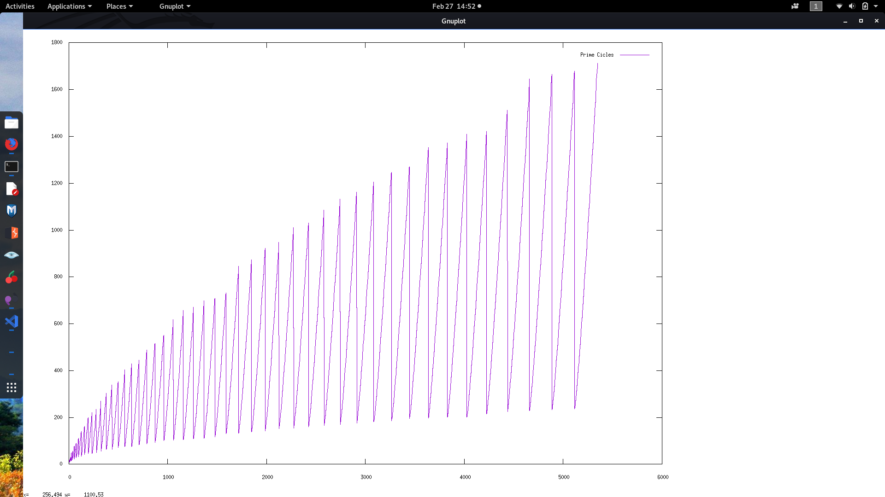

5, 7, 9, 7, 9, 11, 15, 17, 9, 11, 13, 17, 19, 23, 25, 13, 15, 17, 21, 23, 27, 29, 33, 39, 41, 47,
15, 17, 19, 23, 25, 29, 31, 35, 41, 43, 49, 53, 55, 19, 21, 23, 27, 29, 33, 35, 39, 45, 47, 53,
57, 59, 63, 69, 75, 77, 21, 23, 25, 29, 31, 35, 37, 41, 47, 49, 55, 59, 61, 65, 71, 77 

The sequence represents the difference between, the prime products (q*p) and his
totient (q-1*p-1). The sequence allow us to identify primes with the same
fraction cycle , and is composed by semi prime numbers and prime numbers. This
can be interesting for cryptography purposes, or prime factorization
investigation, have some properties who allow to represent graphically the prime
numbers, and this common cycles among numbers.

To build the sequence you just need to get 2 prime numbers, and make the product ,
after that you make the same with the same prime numbers discounting 1 to each
one, the sequence contains the difference between them, each time you get one
difference , you can make the next, with the next combination, (3 * 3)-(2 * 2), 3 * 5 - (2 * 4 ) ...

The sequence can be divided in sub sequences with different longitudes, this
longitudes are prime numbers, and is a way to group numbers by this cycle. The
form to group this sub sequences is each time when the value of the sequence
decreases, for example

5, 7, 9

7, 9, 11, 15, 17

9, 11, 13, 17, 19, 23, 25

.....

Each time the sub secuences are bigger and his longitude is equal to a prime
number, this allow to make groups with numbers with similar properties in factor
terms.

# Haskell Code

primx x= map (primes !!) [1..(fromInteger x)]

sp x =  concat (map (\x-> ( map ( \y-> [x*y,(x-1)*(y-1), (x*y)-((x-1)*(y-1)) ] ) (primx x)) ) (primx x))

# diferences between n and totient , generate a serie with different primes longitudes , 3 , 5, 7, 11 ...

nosserie x = map last (sp x)

splitcycle x s o
        | length rest == 0 = reverse series
        | otherwise = splitcycle rest (s+1) series
        where
                (out,rest) = splitAt (fromInteger (primes !! (fromInteger s))) ( x)
                series =  [out] ++ o

FORMULA a(n) = (p1 * p2) - ((p1 -1) * (p2 - 1))

EXAMPLE With p=3 and q=3, (3 * 3) - (2 * 2) = 5. With p=3 q=5 (3 * 5) - (2*4) = 7. With p=5 q=5 (5 * 5) - (4 * 4) = 9.

# Getting common factors numbers in the serie directly to N cycle group

ncommons 2047 (ceiling (sqrt 2047))

[(23,253),(23,529),(23,575),(23,713),(23,1081),(23,1219),(23,1403),(23,1541),(89,445),(89,623),(89,979),(89,1513)]

